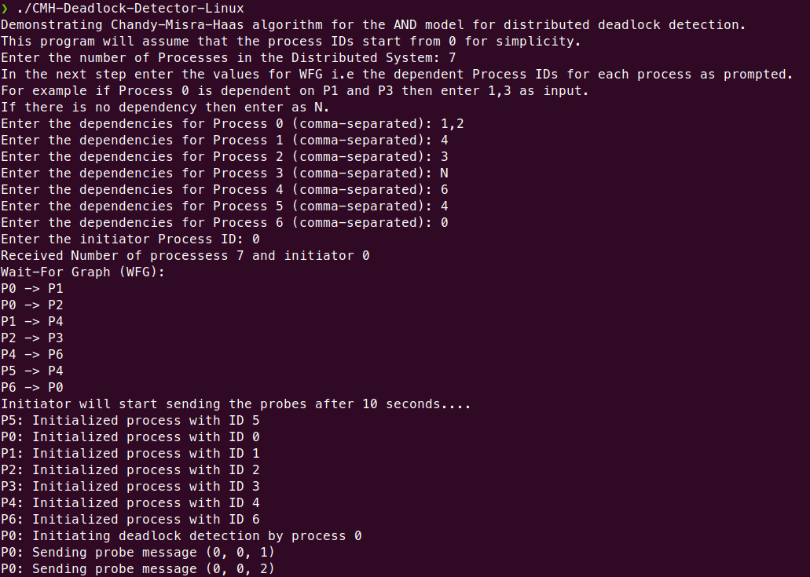
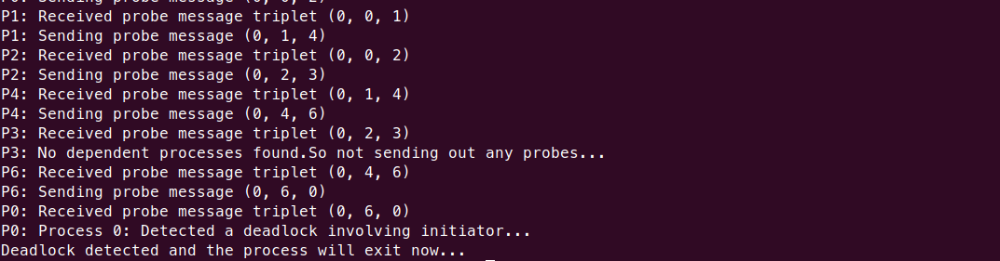

# Chandy-Misra-Haas Algorithm for Distributed Deadlock Detection

This code implements the Chandy-Misra-Haas algorithm for distributed deadlock detection in the AND model. It uses Node.js and the Cluster module, where the master process acts as a mediator for communication between worker processes. The worker processes represent the individual processes in the distributed system.

## Overview

The Chandy-Misra-Haas algorithm detects deadlocks by sending probes between dependent processes. The probes carry the initiator process ID (i), the sender process ID (j), and the receiver process ID (k). If a process receives a probe with the initiator process ID equal to its own process ID, a deadlock is detected.

Each process maintains an array representing its dependencies on other processes (WFG) and another boolean array called `dependent` to track if it has already forwarded a probe for a specific initiator. 

## Assumptions

The following assumptions were made while implementing this algorithm,

1) The concept of Sites is ignored and the probes are sent to all the processes.
2) A process is considered as Blocked if it is dependent on any other process.
3) WFG is received as an input from the User in the form of Process IDs/Numbers.

## Prerequisites

**OS:** Any Operating System that supports NodeJS

**NodeJS Version:** 18.16.0 or greater

## Steps to run the Program

There are two options to run the program,

If NodeJS is installed -> Navigate to the source directory and run `node index.js`.

If NodeJs is not installed then install NodeJs (https://nodejs.org/en/download).

## Input

The user is prompted to provide input for the number of processes, dependencies, and the initiator process using the command-line interface. The input process is as follows:

1. The user is prompted to enter the number of processes with the message: "Enter the number of processes: ". The user should enter a positive integer value and press Enter.

2. For each process, the user is prompted to enter the dependencies with the message: "Enter the dependencies for Process X (comma-separated): ", where X is the process ID (0-indexed). The user should enter a comma-separated list of dependent process IDs for each process and press Enter.

3. The user is prompted to enter the initiator process ID with the message: "Enter the initiator process ID: ". The user should enter a valid process ID (an integer between 0 and the number of processes - 1) and press Enter.

Here's an example of how the input process would look like for a system with 4 processes:

```
Enter the number of processes: 4
Enter the dependencies for Process 0 (comma-separated): 1,3
Enter the dependencies for Process 1 (comma-separated): 2
Enter the dependencies for Process 2 (comma-separated): 3
Enter the dependencies for Process 3 (comma-separated): 0
Enter the initiator process ID: 0
```

In this example, the user has entered 4 processes with the following dependencies:

- Process 0 depends on processes 1 and 3
- Process 1 depends on process 2
- Process 2 depends on process 3
- Process 3 depends on process 0

Process 0 is set as the initiator for the deadlock detection.

After the user has provided the necessary inputs, the master process initializes worker processes with their respective dependencies and starts the deadlock detection by sending a 'start' message to the initiator process.

## Master Process

The master process is responsible for:

1. Receiving user inputs for the number of processes, dependencies, and the initiator process.
2. Creating worker processes and initializing them with their process ID, dependencies, and the total number of processes.
3. Acting as a mediator for communication between worker processes, routing probe messages based on the intended recipient processID.
4. Listening for deadlock reports from worker processes and displaying them.
5. Managing worker process life cycles, including termination.

## Worker Process

The worker process is responsible for:

1. Initializing its dependencies and the `dependent` array upon receiving the 'init' message.
2. Starting the deadlock detection by sending initial probe messages to its dependent processes upon receiving the 'start' message.
3. Handling received probe messages by forwarding them to dependent processes if necessary or detecting deadlocks when the initiator process ID matches its own process ID.

The worker process listens for messages from the master process and handles 'init', 'start', and 'probe' message types accordingly. When a deadlock is detected, the worker process sends a 'deadlock' message to the master process, reporting the detected deadlock.

## Example


